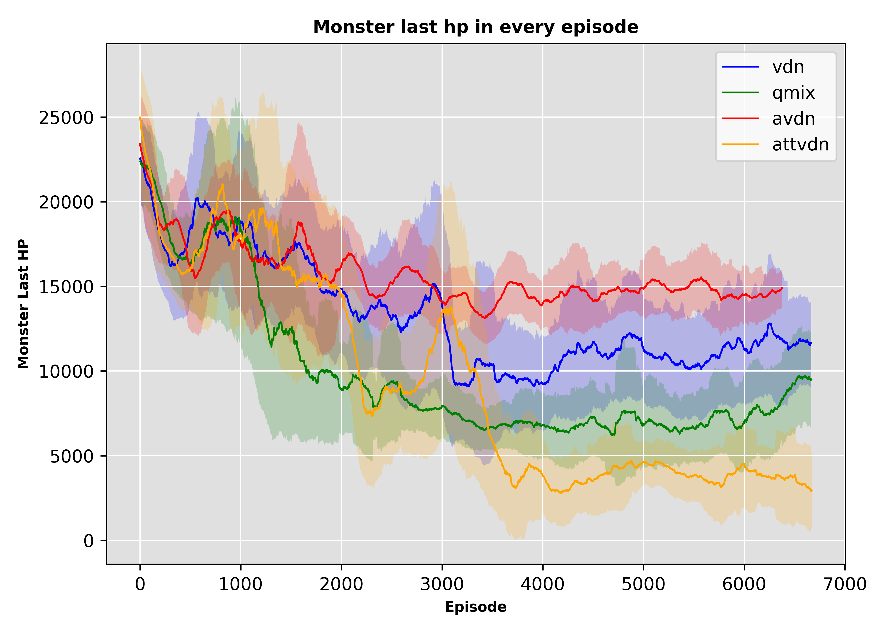

# MARL Experiment in HOK Environment

[Honor of King Env](https://github.com/tencent-ailab/marl-mini)

We propose AVDN and ATTVDN two improvement based on VDN.

- VDN
```math
Q(s, a) \approx \sum_i Q_i(s_i, a_i)
```

- AVDN
```math
Q(s, a) \approx \sum_i MLP_i(s) Q_i(s_i, a_i)
```

- ATTVDN
```math
Q(s, a) \approx MLP(s) + \sum_i ATTEN_i(s, a) Q_i(s_i, a_i)
```


